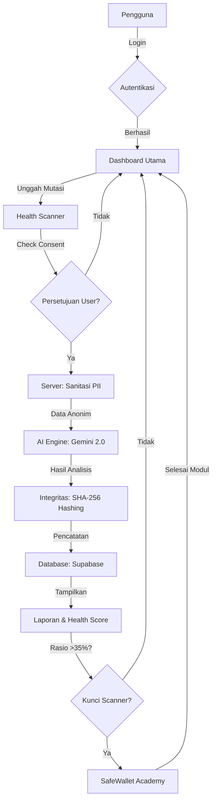

# Jurnal Artikel SafeWallet: Analisis Komprehensif Ekosistem Keamanan Finansial Berbasis AI

**Penulis**: Tim SafeWallet
**Tanggal**: 18 Maret 2026
**Kategori**: Teknologi Keuangan (FinTech), Keamanan Siber, AI Generatif

---

## Abstrak
SafeWallet adalah platform analisis keuangan yang dirancang untuk melindungi pengguna dari jebakan hutang (Pinjol), penipuan investasi (Investasi Bodong), dan pola pengeluaran yang tidak sehat. Dengan mengintegrasikan AI Generatif (Google Gemini 2.0 Flash) dan teknologi *cryptographic hashing* untuk integritas data, SafeWallet menawarkan solusi transparansi finansial bagi masyarakat. Artikel ini mendokumentasikan arsitektur, proses bisnis, kebijakan privasi, dan standar operasional SafeWallet.

---

## 1. Pendahuluan
Meningkatnya aksesibilitas layanan keuangan digital di Indonesia membawa tantangan baru, yaitu tingginya angka gagal bayar pada pinjaman online dan maraknya penipuan berkedok investasi. SafeWallet hadir sebagai "Perisai AI" yang memberdayakan pengguna melalui analisis data mutasi rekening secara anonim dan edukasi finansial yang terukur.

---

## 2. Workflow Lengkap Penggunaan
Proses interaksi pengguna dengan SafeWallet dirancang secara linier dan transparan:

1.  **Registrasi & Autentikasi**: Pengguna mendaftar melalui sistem Supabase Auth yang aman.
2.  **Persetujuan Syarat & Ketentuan (Mandatory)**: Sebelum melakukan aksi apa pun, pengguna wajib menyetujui *Disclaimer* hukum dan kebijakan pemrosesan data oleh pihak ketiga.
3.  **Unggah Dokumen (Mutasi)**: Pengguna mengunggah file mutasi bank (PDF, Excel, Gambar) melalui *Health Scanner*.
4.  **Sanitasi PII (Server-Side)**: Sistem secara otomatis menyamarkan data pribadi (Nama, No. Rekening, Email) sebelum dikirim ke mesin AI.
5.  **Analisis AI Generatif**: AI menganalisis pola transaksi untuk menghitung *Health Score*, rasio cicilan, dan mendeteksi pola mencurigakan (Scam/Ponzi).
6.  **Pencatatan Integritas (Proof-of-Integrity)**: Hash hasil analisis dicatat secara *immutable* untuk menjamin data tidak dimanipulasi.
7.  **Dashboard & Edukasi**: Pengguna menerima laporan visual dan rekomendasi tindakan. Jika rasio cicilan tinggi (>35%), fitur *scanner* akan terkunci dan pengguna wajib menyelesaikan modul di *SafeWallet Academy*.

---

## 3. Flowchart Sistem
Berikut adalah representasi alur arsitektur dan proses bisnis SafeWallet:

---

## 4. Peringatan Keamanan & Risiko Potensial
SafeWallet mengutamakan transparansi risiko bagi penggunanya:

*   **Probabilitas AI**: Hasil analisis AI bersifat probabilistik dan dapat memiliki kesalahan (*false positive/negative*). Jangan gunakan hasil ini sebagai satu-satunya dasar keputusan finansial.
*   **Keamanan File Lokal**: Pengguna bertanggung jawab untuk memastikan file yang diunggah tidak mengandung perangkat lunak berbahaya (*malware*).
*   **Kerahasiaan Akun**: Selalu gunakan autentikasi dua faktor (2FA) jika tersedia untuk melindungi akses ke dashboard SafeWallet Anda.
*   **Batasan Pihak Ketiga**: Meskipun data disamarkan, data diproses oleh Google Gemini. Jangan gunakan data yang sangat rahasia atau di luar transaksi keuangan standar.

---

## 5. Edukasi SafeWallet: Panduan Pengguna
Materi edukasi ini bertujuan meningkatkan literasi finansial:

*   **Memahami Health Score**: Skor 80-100 menandakan kondisi keuangan sehat. Skor <50 menandakan risiko tinggi gagal bayar.
*   **Fitur Scam Check**: Gunakan fitur ini untuk menyalin deskripsi tawaran investasi. AI akan memverifikasi pola Ponzi atau membandingkan dengan status legalitas OJK.
*   **SafeWallet Academy**: Modul interaktif yang mengajarkan manajemen hutang, cara menghadapi penagih hutang (*debt collector*), dan strategi menabung.
*   **Best Practices**: Selalu lakukan scan mutasi setiap akhir bulan untuk memantau tren kesehatan finansial Anda secara konsisten.

---

## 6. Kebijakan Privasi (Privacy Policy)
SafeWallet menerapkan prinsip **Privacy by Design**:

*   **Pengumpulan Data**: Kami hanya mengumpulkan data yang diperlukan untuk analisis (mutasi transaksi). Data identitas seperti Nama dan No. Rekening disamarkan segera setelah diunggah.
*   **Penyimpanan Data**: Data mutasi asli tidak disimpan dalam format teks biasa (*plain text*). Semua data sensitif dienkripsi menggunakan AES-256-GCM.
*   **Penggunaan Data**: Data hanya digunakan untuk memberikan analisis kesehatan finansial kepada Anda. Kami **TIDAK** menjual data pengguna kepada pihak ketiga (broker data, iklan, dsb.).
*   **Penghapusan Data**: Pengguna dapat menghapus seluruh riwayat scan dan data akun secara permanen melalui menu profil.

---

## 7. Manajemen Data & Dokumentasi Teknis

### Struktur Data
Data disimpan dalam database relasional Supabase dengan skema yang teroptimasi:
*   `scans`: Menyimpan hasil analisis, skor kesehatan, dan metadata integritas.
*   `scam_checks`: Menyimpan riwayat deteksi potensi penipuan.
*   `audit_logs`: Mencatat aktivitas sensitif (login, hapus data) untuk keamanan.

### Keamanan & Enkripsi
*   **Enkripsi At-Rest**: Data sensitif dienkripsi menggunakan pustaka `crypto` Node.js dengan algoritma AES-256-GCM.
*   **Enkripsi In-Transit**: Semua komunikasi data menggunakan protokol HTTPS (TLS 1.3).
*   **Integritas Data**: Menggunakan SHA-256 hashing untuk setiap hasil scan, memastikan data yang ditampilkan di dashboard sesuai dengan data yang dicatat saat analisis pertama kali.

---

## 8. Transparansi Operasional
SafeWallet berkomitmen pada mekanisme akuntabilitas:

*   **Audit Internal**: Kami melakukan peninjauan kode (*code review*) secara berkala untuk menutup celah keamanan.
*   **Open Source Components**: SafeWallet menggunakan komponen sumber terbuka (Next.js, Supabase, Tailwind CSS) yang telah teruji secara komunitas.
*   **Laporan Audit**: Hasil audit skalabilitas dan keamanan tersedia bagi kontributor internal untuk dipelajari dan ditingkatkan.

---
*SafeWallet - Teknologi sebagai Alat Keadilan dan Pelindung Finansial Masyarakat.*
