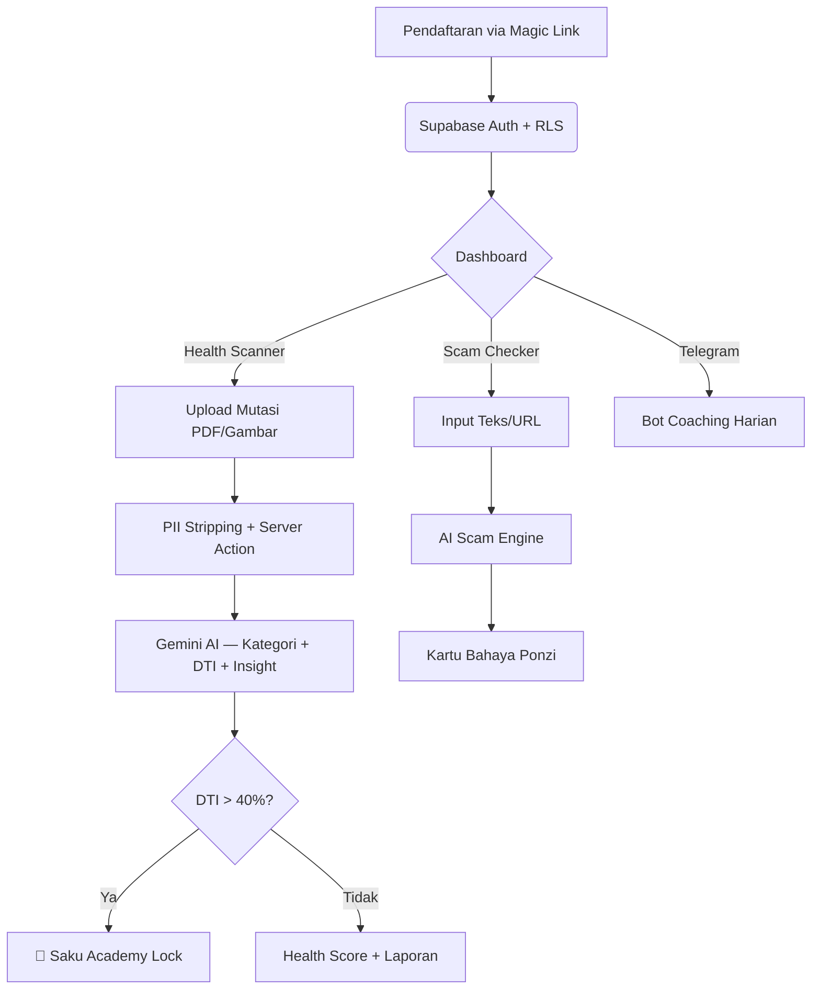
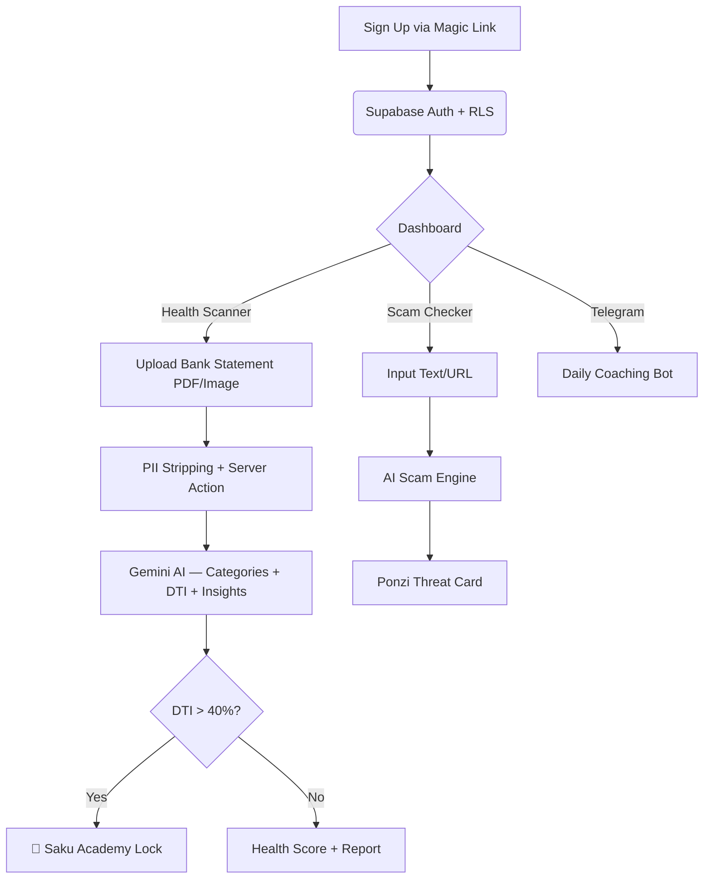

<div align="center">

<br />


<br />
<br />

<h1>🛡️ SafeWallet</h1>
<h3>AI Financial Wellness Platform for Indonesia</h3>

<p>
  <a href="#-bahasa-indonesia">🇮🇩 Bahasa Indonesia</a> · <a href="#-english">🇬🇧 English</a>
</p>

<br />

> [!NOTE]
> **📢 THIS IS A DEMO PROJECT**
> This application is a **demo/prototype** currently running on free-tier **Cloud SaaS** services:
> Supabase (Free), Vercel (Hobby), Upstash Redis (Free), Google Gemini API (Free), and Sentry (Free).
> Capacity, quota, and performance are limited by each service's free-tier constraints.
> **Not recommended for production use with real financial data or high traffic** before upgrading to paid tiers.

</div>

---

# 🇮🇩 Bahasa Indonesia

## Tentang SafeWallet

SafeWallet adalah platform berbasis AI yang dirancang sebagai antitesis terhadap epidemi investasi bodong, kebrutalan Pinjaman Online (Pinjol), dan rendahnya literasi finansial di Indonesia.

> *"Karena tidak ada yang seharusnya hancur hanya karena ketidaktahuan finansial."*

### Konsep & Filosofi Inti

1. **Pembedahan Radikal** — Membedah dokumen mutasi rekening bank secara otomatis menggunakan AI (Google Gemini). Cukup *Drag & Drop*.
2. **Resusitasi Pinjol** — Mendeteksi *Debt-to-Income Ratio*. Jika melampaui 40%, protokol "Saku Academy Lock" diaktifkan.
3. **Peringatan Preventif** — Analisis deskripsi investasi untuk membedah pola Ponzi secara seketika.

### 🌐 Demo Live

| Environment | URL |
|---|---|
| **Production** | [safe-wallet-orpin.vercel.app](https://safe-wallet-orpin.vercel.app) |

---

## 📐 Arsitektur



---

## 🛠 Tech Stack

### Frontend

| Teknologi | Versi | Keterangan |
|---|---|---|
| [Next.js](https://nextjs.org/) | `15` | Framework utama — App Router + Server Actions |
| [React](https://react.dev/) | `19` | UI Library |
| [TypeScript](https://www.typescriptlang.org/) | `5` | Type Safety |
| [Tailwind CSS](https://tailwindcss.com/) | `3` | Utility-first CSS |
| [GSAP](https://gsap.com/) | `3.12` | Animasi scroll cinematic (ScrollTrigger) |
| [Framer Motion](https://www.framer.com/motion/) | `^11` | Transisi halaman & micro-animations |
| [Lucide React](https://lucide.dev/) | Latest | Icon system |

### Backend & Database

| Teknologi | Keterangan |
|---|---|
| [Supabase](https://supabase.com/) *(Free Tier)* | PostgreSQL + Auth (Magic Link) + Row-Level Security |
| [Next.js API Routes](https://nextjs.org/) | REST endpoints: scan, scam-check, webhooks, cron |

### AI & Intelligence

| Teknologi | Keterangan |
|---|---|
| [Google Gemini 2.0 Flash](https://ai.google.dev/) *(Free Tier)* | OCR mutasi bank, kategorisasi, scam detection |
| Custom PII Sanitizer | Menghapus NIK/email/rekening sebelum dikirim ke AI |

### Infrastructure

| Teknologi | Keterangan |
|---|---|
| [Vercel](https://vercel.com/) *(Hobby)* | Hosting + Serverless + Edge Middleware |
| [Upstash Redis](https://upstash.com/) *(Free Tier)* | IP-based Rate Limiting |
| [Midtrans](https://midtrans.com/) | Payment Gateway — SHA-512 webhook verification |
| [Sentry](https://sentry.io/) *(Free Tier)* | Error monitoring & alerting |
| [Telegram Bot API](https://core.telegram.org/bots/api) | Daily coaching notifications |

### Security Stack

| Mekanisme | Detail |
|---|---|
| Signature Verification | SHA-512 Midtrans, Telegram Secret Token |
| Rate Limiting | Upstash Redis — IP-based (AI: 5/min, General: 50/min) |
| PII Stripping | Regex redaction sebelum AI processing |
| Audit Logging | `audit_logs` table — user actions + IP + user-agent |
| Zero-Retention | File mutasi **tidak pernah disimpan** — hanya diproses di RAM |
| OWASP Headers | HSTS, CSP, X-Frame-Options, Referrer-Policy |

> [!IMPORTANT]
> **Catatan Cloud SaaS:** Seluruh infrastruktur menggunakan tier gratis dari layanan cloud. Untuk produksi yang serius, diperlukan upgrade ke paid tier dari Supabase, Vercel, dan Upstash.

---

## ⚙️ Instalasi Lokal

```bash
# 1. Clone
git clone https://github.com/kazanaruishere-max/SafeWallet.git && cd SafeWallet

# 2. Install dependencies
npm install

# 3. Setup environment
cp .env.example .env.local
# Isi kredensial di .env.local

# 4. Jalankan
npm run dev
```

Buka [http://localhost:3000](http://localhost:3000).

### Environment Variables

| Variable | Wajib | Keterangan |
|---|---|---|
| `NEXT_PUBLIC_SUPABASE_URL` | ✅ | URL Project Supabase |
| `NEXT_PUBLIC_SUPABASE_ANON_KEY` | ✅ | Anon Key Supabase |
| `SUPABASE_SERVICE_ROLE_KEY` | ✅ | Service Role Key (untuk admin operations) |
| `GEMINI_API_KEY` | ✅ | Google AI Studio API Key |
| `UPSTASH_REDIS_REST_URL` | ⬜ | Upstash Redis URL (untuk rate limiting) |
| `UPSTASH_REDIS_REST_TOKEN` | ⬜ | Upstash Redis Token |
| `MIDTRANS_SERVER_KEY` | ⬜ | Midtrans Server Key |
| `TELEGRAM_BOT_TOKEN` | ⬜ | Telegram Bot Token |
| `CRON_SECRET` | ⬜ | Secret untuk cron job authentication |

---

## 🚦 Roadmap

| Fase | Status | Deskripsi |
|---|---|---|
| **Fase 1 — MVP** | ✅ | AI Scanner, Scam Detector, Telegram, Langganan |
| **Fase 2 — OJK API** | 🔲 | Sinkronisasi dengan Blacklist SWI OJK |
| **Fase 3 — Side-Hustle AI** | 🔲 | RAG Database pekerjaan freelance |
| **Fase 4 — Crisis Button** | 🔲 | Panic Button ke bantuan psikologis |

---

# 🇬🇧 English

## About SafeWallet

SafeWallet is an AI-powered financial wellness platform designed to combat the epidemic of investment fraud, predatory online lending (Pinjol), and low financial literacy in Indonesia.

> *"Because no one should be destroyed simply by financial ignorance."*

### Core Concepts

1. **Radical Transparency** — Automatically dissect bank statement documents using AI (Google Gemini) to track every financial leak. Just *Drag & Drop*.
2. **Debt-Snowball Rescue** — Detects Debt-to-Income Ratio automatically. If it exceeds 40%, the "Saku Academy Lock" protocol is triggered to guide users out of crisis.
3. **Scam Interceptor** — Before sending money to an entity promising unrealistic returns, users can analyze investment descriptions. The AI will dissect Ponzi patterns instantly.

### 🌐 Live Demo

| Environment | URL |
|---|---|
| **Production** | [safe-wallet-orpin.vercel.app](https://safe-wallet-orpin.vercel.app) |

---

## 📐 Architecture



---

## 🛠 Tech Stack

### Frontend

| Technology | Version | Description |
|---|---|---|
| [Next.js](https://nextjs.org/) | `15` | Core framework — App Router + Server Actions |
| [React](https://react.dev/) | `19` | UI Library |
| [TypeScript](https://www.typescriptlang.org/) | `5` | Type Safety |
| [Tailwind CSS](https://tailwindcss.com/) | `3` | Utility-first CSS |
| [GSAP](https://gsap.com/) | `3.12` | Cinematic scroll animations (ScrollTrigger) |
| [Framer Motion](https://www.framer.com/motion/) | `^11` | Page transitions & micro-animations |
| [Lucide React](https://lucide.dev/) | Latest | Icon system |

### Backend & Database

| Technology | Description |
|---|---|
| [Supabase](https://supabase.com/) *(Free Tier)* | PostgreSQL + Auth (Magic Link) + Row-Level Security |
| [Next.js API Routes](https://nextjs.org/) | REST endpoints: scan, scam-check, webhooks, cron |

### AI & Intelligence

| Technology | Description |
|---|---|
| [Google Gemini 2.0 Flash](https://ai.google.dev/) *(Free Tier)* | Bank statement OCR, categorization, scam detection |
| Custom PII Sanitizer | Strips personal data (IDs, emails, accounts) before AI processing |

### Infrastructure

| Technology | Description |
|---|---|
| [Vercel](https://vercel.com/) *(Hobby)* | Hosting + Serverless Functions + Edge Middleware |
| [Upstash Redis](https://upstash.com/) *(Free Tier)* | IP-based Rate Limiting |
| [Midtrans](https://midtrans.com/) | Payment Gateway — SHA-512 webhook verification |
| [Sentry](https://sentry.io/) *(Free Tier)* | Error monitoring & alerting |
| [Telegram Bot API](https://core.telegram.org/bots/api) | Daily coaching notifications |

### Security Stack

| Mechanism | Details |
|---|---|
| Signature Verification | SHA-512 Midtrans, Telegram Secret Token |
| Rate Limiting | Upstash Redis — IP-based (AI: 5/min, General: 50/min) |
| PII Stripping | Regex redaction before AI processing |
| Audit Logging | `audit_logs` table — user actions + IP + user-agent |
| Zero-Retention | Uploaded files are **never stored** — processed in memory only |
| OWASP Headers | HSTS, CSP, X-Frame-Options, Referrer-Policy |

> [!IMPORTANT]
> **Cloud SaaS Note:** The entire infrastructure runs on free-tier cloud services. For serious production use, upgrading to paid tiers of Supabase, Vercel, and Upstash is required.

---

## ⚙️ Local Installation

```bash
# 1. Clone
git clone https://github.com/kazanaruishere-max/SafeWallet.git && cd SafeWallet

# 2. Install dependencies
npm install

# 3. Setup environment
cp .env.example .env.local
# Fill in credentials in .env.local

# 4. Run
npm run dev
```

Open [http://localhost:3000](http://localhost:3000).

---

## 🚦 Roadmap

| Phase | Status | Description |
|---|---|---|
| **Phase 1 — MVP** | ✅ | AI Scanner, Scam Detector, Telegram, Subscription |
| **Phase 2 — OJK API** | 🔲 | Sync with Indonesia Financial Authority Blacklist |
| **Phase 3 — Side-Hustle AI** | 🔲 | RAG-based freelance job matching against user expense gaps |
| **Phase 4 — Crisis Button** | 🔲 | Panic button connected to psychological help hotlines |

---

<div align="center">

## ⚖️ Security | Keamanan

Built with **Zero-Trust** principles. Bank statements are **never stored** permanently.
100% Row-Level Security on all Supabase tables. Full audit trail for sensitive actions.

See [SECURITY.md](SECURITY.md) for details.

---

## 🧑‍💻 Creator | Kreator

Built with dedication by **[Kazanaru](https://github.com/kazanaruishere-max)**.

> *"Code is a shield. Technology is a tool for justice."*

---

## 📜 License | Lisensi

Distributed under the **MIT License**. See [LICENSE](LICENSE) for details.

Copyright © 2026 **Kazanaru**

</div>
